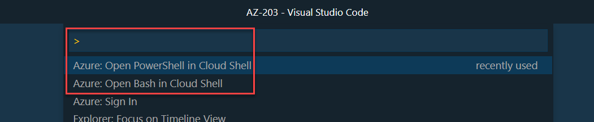

# Implement solutions that use virtual machines

## Creating VMs

---

### Azure CLI

[Azure CLI Reference](https://docs.microsoft.com/en-us/cli/azure/reference-index?view=azure-cli-latest)

[Azure CLI Query](https://docs.microsoft.com/en-us/cli/azure/query-azure-cli?view=azure-cli-latest)

[JMESPath Documentation](http://jmespath.org/)

[Azure Account - VS Code Extension](https://marketplace.visualstudio.com/items?itemName=ms-vscode.azure-account#review-details)

Log In:

```bash
az login
```

Try at cmd - use ctrl + d to exit:

```
az interactive
```

> Note: You can also use: `F1 - Open Bash in Cloud Shell` using Azure Account Extension



List available extensions:

```bash
az extension list-available --output table
az extension add --name <extension-name>
```

Create a Ubuntu VM

```
az group create -g az-203 -l westeurope
az vm list-sizes --location westeurope -o table
az vm create -g az-203 -n UbuntuSrv --image debian --size Standard_B1ms --generate-ssh-keys --admin-username azureuser
```

Connect to VM

```
ssh azureuser@104.40.251.162

```

### PowerShell

[Azure Powershell](https://docs.microsoft.com/en-us/powershell/azure/?view=azps-3.3.0)

[Azure Porwershell Reference](https://docs.microsoft.com/en-us/powershell/module/?view=azps-2.8.0)

---

Install Azure PowerShell

```
Install-Module -Name PowerShellGet -Force
Install-Module -Name Az -AllowClobber -Scope CurrentUser
```

Create VM in Cloud Shell:

```
New-AzResourceGroup -Name az-203 -Location westeurope

$cred = Get-Credential
$VMSize = "Standard_B1ms"

New-AzVm `
 -ResourceGroupName "az-203" `
 -Name "winVM" `
 -Location "westeurope" `
 -VirtualNetworkName "myVnet" `
 -SubnetName "mySubnet" `
 -SecurityGroupName "myNetworkSecurityGroup" `
 -PublicIpAddressName "myPublicIpAddress" `
 -Size $VMSize `
 -OpenPorts 80,3389 `
 -Credential $cred
```

Connect to VM:

```
Get-AzPublicIpAddress -ResourceGroupName az-203 | Select "IpAddress"
mstsc /v:publicIpAddress
```

## ARM Remplates

---

[Azure Quickstarter Templates](https://azure.microsoft.com/en-us/resources/templates/)

[Github Quickstarter Templates](https://github.com/Azure/azure-quickstart-templates)

## Disk Encryption

```
az keyvault create --location westeurope -n az203vaultap --resource-group az-203

az keyvault update -n az203vaultap -g az-203 --enabled-for-disk-encryption "true"

az vm encryption show -g az-203 -n winVM

az vm encryption enable -g az-203 -n winVM --disk-encryption-keyvault az203vaultap --volume-type all
```

## Using ARM Templates

Running templates from the command line:

az deployment group create -g az-400 --template-file azuredeploy.json --parameters storageAcctName="az400teststorageaccount"

> Note: Change to the according folder

[Try this template](https://azure.microsoft.com/de-de/resources/templates/201-encrypt-running-windows-vm/)

```
az deployment group create -g az-203 -n winVM --template-uri https://raw.githubusercontent.com/azure/azure-quickstart-templates/master/201-encrypt-running-windows-vm/azuredeploy.json
```
