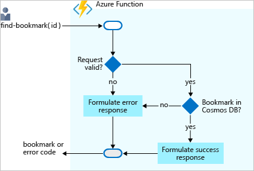

# Function Apps

[Azure Functions](https://docs.microsoft.com/en-us/azure/azure-functions/functions-overview)

[az functionapp](https://docs.microsoft.com/en-us/cli/azure/functionapp?view=azure-cli-latest)

[Triggers & Binding](https://docs.microsoft.com/en-us/azure/azure-functions/functions-triggers-bindings)

[Register Bindings](https://docs.microsoft.com/en-us/azure/azure-functions/functions-bindings-register)

[Azure Durable Functions Documentation](https://docs.microsoft.com/en-us/azure/azure-functions/durable/)

[Azure Functions Durable Extensions](https://github.com/Azure/azure-functions-durable-extension)

## Instructions

Provision required Services:

Create Funtion App in Azure manually or using `create-func-app.azcli`

### Getting Started

Install azure-function-tools - requires Node.js:

```
npm i -g azure-functions-core-tools
npm install -g azure-functions-core-tools@3
```

> Note: Documentaion can be found on [Github](https://github.com/Azure/azure-functions-core-tools) or on [docs.microsoft.com](https://docs.microsoft.com/en-us/azure/azure-functions/functions-run-local?tabs=windows%2Ccsharp%2Cbash)

https://docs.microsoft.com/en-gb/azure/azure-functions/functions-reference

Scaffold Project:

```
func init vscode-functs --dotnet
cd vscode-functs
```

> Note select `dotnet`

Create a new Function:

```
func new --name MyHttpTrigger --template "HttpTrigger"
```

Run function locally:

```
func start --build
```

or use host keyword requried in v1

```
func host start --build
```

Execute:

```bash
curl --request POST http://localhost:7071/api/MyHttpTrigger --data '{"name":"Azure Rocks"}'
```

Publish App to Azure using CLI

```
func azure functionapp publish az203-fx-7179
```

### JavaScript Functions

#### Simple Interest

Open project js-functions ... press F5 & Execute

```
func start
```

Open another terminal

```
curl "http://localhost:7071/api/simple-interest?principal=5000&rate=.035&term=36"
```

> Note: You might have to switch to Node 10.x

#### Bindings



Create DB usin `create-sql-cosmos.azcli` & `create-storage-acct.azcli`

Import Data from `binding-data.json`

Test `find-bookmark`

> Note: If you want to can finish this [exercise](https://docs.microsoft.com/en-us/learn/modules/chain-azure-functions-data-using-bindings/7-write-data-with-output-bindings-portal-lab?pivots=javascript) later on.

#### Durable

Demo: durable-vscode

Hit F5 & execute Request: http://localhost:7071/api/orchestrators/HelloOrchestrator

[Durable Functions Walkthrough](https://docs.microsoft.com/en-us/azure/azure-functions/durable/quickstart-js-vscode)
